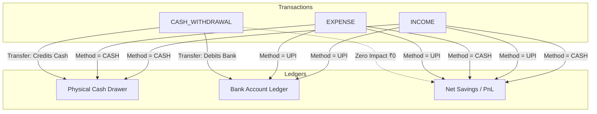

# Cashly — Smart Financial Management & Dual-Ledger Accounting

Cashly is a modern, high-precision financial management system engineered for individuals, shop owners, and small businesses. Unlike conventional expense trackers that treat money as a single monolithic pool, Cashly implements a **dual-ledger financial architecture** that strictly separates **physical cash** from **digital bank/UPI balances**, providing automated cash tallying, bank account reconciliation, voice transaction entry in Tamil and English, and multi-page PDF financial statements.

Built with a **React 18 + Vite** frontend, a high-throughput **Node.js / Express** REST API, and **MongoDB Atlas** for persistence, Cashly runs natively as a responsive Web Application and as a native Android APK via **Capacitor**.

---

## Table of Contents

- [Core Problem & Solution](#core-problem--solution)
- [Key Features](#key-features)
- [Dual-Ledger Accounting Model](#dual-ledger-accounting-model)
- [System Architecture](#system-architecture)
- [Repository Structure](#repository-structure)
- [Technology Stack](#technology-stack)
- [Authentication & Security](#authentication--security)
- [Modules & Workflows](#modules--workflows)
  - [1. Transaction Management](#1-transaction-management)
  - [2. Physical Cash & Denomination Tallying](#2-physical-cash--denomination-tallying)
  - [3. Bank Accounts & UPI Reconciliation](#3-bank-accounts--upi-reconciliation)
  - [4. AI Voice Transaction Entry (Tamil & English)](#4-ai-voice-transaction-entry-tamil--english)
  - [5. PDF Statement & Financial Reports Engine](#5-pdf-statement--financial-reports-engine)
  - [6. Account-Level Cloud & Offline Backup](#6-account-level-cloud--offline-backup)
  - [7. Bilingual Localization](#7-bilingual-localization)
- [Database Schema (MongoDB)](#database-schema-mongodb)
- [REST API Reference](#rest-api-reference)
- [Environment Configuration](#environment-configuration)
- [Local Development Setup](#local-development-setup)
- [Android Build & Deployment](#android-build--deployment)
- [Testing & Quality Assurance](#testing--quality-assurance)
- [License](#license)

---

## Core Problem & Solution

### The Problem
Traditional money-tracking applications suffer from significant architectural flaws:
1. **Monolithic Balances**: They merge cash and bank accounts into a single number. When your app says you have ₹25,000, you don't know how much is physically in your cash drawer versus in your bank account.
2. **Transfer Classification Errors**: ATM cash withdrawals or bank transfers are often incorrectly recorded as "Expenses" or "Income", distorting profit/loss figures.
3. **No Physical Tallying**: There is no mechanism to count physical currency notes (₹500, ₹200, ₹100, ₹50, ₹20, ₹10) and verify if the cash drawer matches the day's transactions.
4. **Device-Isolated Cloud Backups**: Cloud backup status is frequently isolated to browser `localStorage`, leading to out-of-sync states between mobile apps and web browsers.

### The Cashly Solution
- **Rigorous Dual-Ledger Tracking**: Tracks physical cash independently from multiple bank accounts.
- **Zero-Sum Transfers**: ATM cash withdrawals debit the bank account and credit physical cash with **₹0 net effect** on Income, Expense, or Net Savings.
- **Physical Cash Counting**: Dedicated denomination counter with automatic `TALLIED`, `SHORT`, or `EXTRA` status calculation.
- **Account-Level Synchronized Backup**: Google Drive cloud backup state and timestamps are persisted in the user's MongoDB profile, ensuring seamless multi-device synchronization.
- **One-Tap Professional Statements**: Vector-rendered, UTF-8-compliant PDF generation for single-day passbooks and multi-page period range reports.

---

## Key Features

| Feature | Description |
| :--- | :--- |
| **Dual-Ledger Accounting** | Physical cash and multiple bank accounts are maintained independently. |
| **Transaction Workflows** | Fast entry for Income, Expense, and ATM Cash Withdrawals with custom names and descriptions. |
| **Physical Cash Counting** | Currency denomination tallying (₹500 down to ₹10 + coins) with difference detection. |
| **Bank Account Management** | Multi-bank support (IOB, SBI, HDFC, etc.) with UPI inflow/outflow attribution. |
| **ATM Withdrawal Transfers** | Clean `BANK → CASH` routing without corrupting financial P&L. |
| **Voice Transaction Entry** | Natural language voice input supporting Tamil (`வரவு`, `செலவு`) and English speech parsing. |
| **Single-Day PDF Statement** | Strictly one-page A4 passbook breakdown with timestamped logs and bank positions. |
| **Multi-Page Range Report** | Executive summary, day-by-day continuous matrix, cash flow, and detailed transaction audit. |
| **Account-Level Google Drive Backup** | Server-synchronized cloud backup to Google Drive `appDataFolder` across Chrome & Android. |
| **Offline JSON Portability** | Export/import full JSON database dumps with sequential closing recalculation. |
| **Bilingual Localization** | 100% complete English and Tamil (`தமிழ்`) UI and PDF rendering. |

---

## Dual-Ledger Accounting Model

Cashly enforces mathematical rigor across every transaction type:



### Mathematical Rules
1. **Cash Income**: Increases Expected Cash (`+₹X`), increases Net Savings (`+₹X`).
2. **Cash Expense**: Decreases Expected Cash (`-₹X`), decreases Net Savings (`-₹X`).
3. **UPI Income**: Increases Selected Bank Balance (`+₹X`), increases Net Savings (`+₹X`).
4. **UPI Expense**: Decreases Selected Bank Balance (`-₹X`), decreases Net Savings (`-₹X`).
5. **ATM Cash Withdrawal**: Decreases Selected Bank Balance (`-₹X`), increases Expected Cash (`+₹X`), Net Savings impact = **₹0**.

---

## System Architecture

```mermaid
flowchart TD
    subgraph Client Layer
        Web[Chrome / Desktop Browser]
        Android[Android APK Capacitor 8]
    end

    subgraph Application Services
        AuthContext[Auth & Session Manager]
        GoogleAuth[Capacitor / GIS OAuth]
        SpeechService[Tamil/English Speech NLP]
        PDFEngine[jsPDF + HTML Canvas Vector Engine]
        DriveService[Google Drive Sync Service]
    end

    subgraph Backend REST API Node Express
        AuthRoutes[/api/auth]
        TxRoutes[/api/transactions]
        BankRoutes[/api/bank-accounts]
        CashRoutes[/api/cash]
        SummaryRoutes[/api/summary]
        SettingsRoutes[/api/settings]
    end

    subgraph Storage & Cloud
        MongoDB[(MongoDB Atlas Mongoose)]
        GDrive[(Google Drive appDataFolder)]
    end

    Web --> AuthContext
    Android --> AuthContext

    AuthContext --> AuthRoutes
    Web --> GoogleAuth
    Android --> GoogleAuth

    Web --> PDFEngine
    Android --> PDFEngine

    Web --> SpeechService
    Android --> SpeechService

    AuthRoutes --> MongoDB
    TxRoutes --> MongoDB
    BankRoutes --> MongoDB
    CashRoutes --> MongoDB
    SummaryRoutes --> MongoDB
    SettingsRoutes --> MongoDB

    GoogleAuth --> DriveService
    DriveService --> GDrive
    DriveService --> SettingsRoutes
```

---

## Repository Structure

```
Money-Tracker/
├── Cashly.apk                      # Compiled release Android APK binary
├── backend/                        # Node.js Express REST API backend
│   ├── db_mongo.js                 # Mongoose schemas & MongoDB connection
│   ├── server.js                   # Express application entrypoint & middleware
│   ├── middleware/
│   │   └── auth.js                 # JWT Bearer token authentication middleware
│   ├── routes/
│   │   ├── auth.js                 # Register, Login, Google OAuth, Profile
│   │   ├── bankAccounts.js         # Multi-bank account CRUD & balance checks
│   │   ├── cash.js                 # Cash counting, closing, and expected cash
│   │   ├── settings.js             # User settings, Google Drive sync, Export/Restore
│   │   ├── summary.js              # Daily details, monthly rollup, and range reports
│   │   └── transactions.js         # Transaction CRUD & balance recalculation
│   └── services/
│       ├── bankAccountService.js   # Bank balance calculation engine
│       └── cashCalculationService.js # Day-by-day cash ledger rollover engine
├── frontend/                       # React 18 + Vite frontend
│   ├── android/                    # Capacitor Android native studio project
│   ├── build-apk.cjs               # Automated Vite build + Gradle APK compiler
│   ├── src/
│   │   ├── App.jsx                 # Screen router & state orchestration
│   │   ├── main.jsx                # React DOM entrypoint
│   │   ├── components/             # Reusable UI components
│   │   │   ├── BottomNav.jsx       # Fixed ergonomic navigation bar
│   │   │   ├── Header.jsx          # Header with user profile trigger
│   │   │   ├── PageContainer.jsx   # Responsive container wrapper
│   │   │   ├── TransactionModal.jsx# Quick transaction modal
│   │   │   └── VoiceEntryModal.jsx # Tamil/English speech input modal
│   │   ├── context/
│   │   │   └── AuthContext.jsx     # User session & JWT state provider
│   │   ├── screens/                # Application views
│   │   │   ├── AddExpenseScreen.jsx
│   │   │   ├── AddIncomeScreen.jsx
│   │   │   ├── BankAccountDetailsScreen.jsx
│   │   │   ├── BanksScreen.jsx
│   │   │   ├── CashAtHomeScreen.jsx
│   │   │   ├── CloseDayScreen.jsx
│   │   │   ├── CountCashScreen.jsx
│   │   │   ├── DailyDetailsScreen.jsx
│   │   │   ├── HistoryScreen.jsx
│   │   │   ├── HomeScreen.jsx
│   │   │   ├── LoginScreen.jsx
│   │   │   ├── MonthlySummaryScreen.jsx
│   │   │   ├── ReconciliationScreen.jsx
│   │   │   ├── ReportsScreen.jsx
│   │   │   ├── SettingsScreen.jsx
│   │   │   ├── SimplePassbookView.jsx
│   │   │   ├── TransactionDetailsScreen.jsx
│   │   │   └── TransactionsScreen.jsx
│   │   ├── services/               # API & client services
│   │   │   ├── api.js              # Centralized Axios/fetch API client
│   │   │   ├── backupScheduler.js  # Automated background backup triggers
│   │   │   ├── googleAuth.js       # Native & Web Google OAuth provider
│   │   │   ├── googleDriveService.js # Drive API appDataFolder manager
│   │   │   └── speechRecognitionService.js # Web & Capacitor Speech wrapper
│   │   ├── styles/
│   │   │   ├── designTokens.js     # Typography, color tokens, elevation
│   │   │   └── index.css           # CSS variables & typography baseline
│   │   └── utils/                  # Domain utilities
│   │       ├── pdfGenerator.js     # High-DPI Tamil UTF-8 PDF Engine
│   │       ├── tamilNumberParser.js# Tamil numerals & word NLP parser
│   │       ├── transactionParser.js# Speech-to-transaction entity extractor
│   │       ├── transcriptNormalizer.js # Tamil phonetic normalization
│   │       └── translations.js     # English & Tamil localization dictionary
│   └── vite.config.js              # Vite bundler configuration
└── package.json                    # Workspace metadata
```

---

## Technology Stack

### Frontend
- **Framework**: React 18.2.0
- **Build Tool**: Vite 5.1.4
- **Icons**: Lucide React (`lucide-react`)
- **PDF Engine**: jsPDF 4.2.1 + `html2canvas` for crisp 200+ DPI vector & Tamil glyph shaping
- **Mobile Container**: Capacitor 8.5.0 (`@capacitor/android`, `@capacitor/core`, `@capacitor/filesystem`, `@capacitor/share`, `@capacitor-community/speech-recognition`)

### Backend
- **Runtime**: Node.js (v18+)
- **Framework**: Express.js 4.19.2
- **Database Engine**: MongoDB 8.2 (via Mongoose ODM)
- **Security**: `bcryptjs` (password hashing), `jsonwebtoken` (JWT Session Bearer tokens)
- **OAuth Validation**: `google-auth-library` (Server-side Google ID token verification)

---

## Authentication & Security

- **Hybrid Authentication**: Supports both secure Email/Password authentication and one-tap Google OAuth Sign-In.
- **Stateless JWT Authorization**: All protected endpoints enforce `authenticateToken` middleware parsing `Authorization: Bearer <token>`.
- **Scoped User Isolation**: Every database record (`Transaction`, `BankAccount`, `CashCount`, `DailyClosing`) is strictly bound to `userId`.
- **Google Drive Security**: The client requests only `https://www.googleapis.com/auth/drive.appdata` scope. Cashly can only access its own private application folder and cannot inspect personal user files.

---

## Modules & Workflows

### 1. Transaction Management
- Categorized as `INCOME`, `EXPENSE`, or `CASH_WITHDRAWAL`.
- Payment methods: `CASH`, `UPI`, `BANK`, `CARD`, `OTHER`.
- Primary display uses `transactionName` with fallback to `name`.
- Optional multi-line descriptions preserved across reports and audit trails.

### 2. Physical Cash & Denomination Tallying
- Denomination counters for ₹500, ₹200, ₹100, ₹50, ₹20, ₹10, and loose coins.
- Real-time comparison between Physical Counted Cash and Expected System Cash.
- Closing status tags: `TALLIED` (Difference = ₹0), `SHORT` (Deficit), or `EXTRA` (Surplus).

### 3. Bank Accounts & UPI Reconciliation
- Maintain multiple bank accounts with custom names and opening balances.
- UPI transactions require account association, ensuring exact balance tracking per bank.
- Balance check audit logs to reconcile physical passbooks with recorded balances.

### 4. AI Voice Transaction Entry (Tamil & English)
- Speech recognition via Web Speech API (Browser) and `@capacitor-community/speech-recognition` (Android).
- Custom Tamil NLP engine parses spoken numerals (`ஐநூறு` → 500, `ஆயிரம்` → 1000) and classifications (`வரவு` → Income, `செலவு` → Expense).

### 5. PDF Statement & Financial Reports Engine
- **Single-Day Passbook**: Strictly 1-page A4 format containing executive totals, cash drawer status, bank accounts summary, and timestamped transactions.
- **Financial Range Report**: Multi-page detailed report with Period Executive Summary, Day-by-Day continuous matrix, Cash Movement analysis, Bank-level activity, detailed transaction logs, and final consolidated position.
- **Tamil Unicode UTF-8 Support**: Full font shaping using `Noto Sans Tamil` and `Mukta Malar`.
- **Android Integration**: Native Android file save to `Directory.Documents` with automatic Share sheet prompt via `@capacitor/share`.

### 6. Account-Level Cloud & Offline Backup
- **Account-Level Google Drive Sync**: Connection status (`connected`, `googleEmail`, `lastBackupAt`) is persisted in MongoDB. Connecting on Chrome immediately updates Android APK to `Connected ✓`.
- **Offline JSON Portability**: Full JSON export and restore capability with automatic sequential daily closings recalculation.

### 7. Bilingual Localization
- Complete in-app language switching between **English** and **Tamil** (`தமிழ்`).
- All screen titles, buttons, status badges, forms, and PDF reports dynamically adapt to the selected language.

---

## Database Schema (MongoDB)

### User Schema (`User`)
```javascript
{
  id: { type: String, required: true, unique: true },
  googleId: { type: String, unique: true, sparse: true },
  fullName: { type: String, required: true },
  email: { type: String, required: true, unique: true },
  profileImage: { type: String, default: '' },
  passwordHash: { type: String, default: '' },
  googleDrive: {
    connected: { type: Boolean, default: false },
    googleEmail: { type: String, default: null },
    googleUserId: { type: String, default: null },
    connectedAt: { type: Date, default: null },
    lastBackupAt: { type: Date, default: null },
    lastBackupStatus: { type: String, enum: ['SUCCESS', 'FAILED', 'PENDING', null] },
    backupFrequency: { type: String, enum: ['daily', 'weekly', 'manual', 'disabled'], default: 'weekly' }
  },
  createdAt: { type: Date, default: Date.now },
  updatedAt: { type: Date, default: Date.now }
}
```

### Transaction Schema (`Transaction`)
```javascript
{
  id: { type: String, required: true, unique: true },
  userId: { type: String, required: true, index: true },
  type: { type: String, enum: ['INCOME', 'EXPENSE', 'CASH_WITHDRAWAL'], required: true },
  amount: { type: Number, required: true, min: 0.01 },
  transactionName: { type: String, default: '' },
  name: { type: String, default: '' },
  category: { type: String, default: '' },
  paymentMethod: { type: String, enum: ['CASH', 'UPI', 'BANK', 'CARD', 'OTHER'], required: true },
  accountId: { type: String, default: null, index: true },
  description: { type: String, default: '' },
  date: { type: String, required: true, index: true }, // YYYY-MM-DD
  createdAt: { type: Date, default: Date.now }
}
```

### Bank Account Schema (`BankAccount`)
```javascript
{
  id: { type: String, required: true, unique: true },
  userId: { type: String, required: true, index: true },
  name: { type: String, required: true },
  openingBalance: { type: Number, default: 0 },
  createdAt: { type: Date, default: Date.now }
}
```

### Daily Closing Schema (`DailyClosing`)
```javascript
{
  id: { type: String, required: true, unique: true },
  userId: { type: String, required: true, index: true },
  date: { type: String, required: true, index: true },
  openingCash: { type: Number, default: 0 },
  cashIncome: { type: Number, default: 0 },
  cashExpense: { type: Number, default: 0 },
  cashWithdrawal: { type: Number, default: 0 },
  expectedClosingCash: { type: Number, default: 0 },
  physicalCash: { type: Number, default: 0 },
  difference: { type: Number, default: 0 },
  status: { type: String, enum: ['TALLIED', 'SHORT', 'EXTRA'], default: 'TALLIED' },
  isClosed: { type: Boolean, default: true },
  createdAt: { type: Date, default: Date.now }
}
```

---

## REST API Reference

### Authentication (`/api/auth`)
- `POST /register`: Create account with `fullName`, `email`, `password`.
- `POST /login`: Authenticate and receive JWT token.
- `POST /google`: Authenticate with Google OAuth ID token.
- `GET /me`: Retrieve profile of currently authenticated user.
- `PUT /profile`: Update profile information.
- `PUT /change-password`: Change password.

### Transactions (`/api/transactions`)
- `GET /`: List transactions (supports `?date=YYYY-MM-DD` and pagination).
- `POST /`: Create transaction (`type`, `amount`, `transactionName`, `paymentMethod`, `accountId`, `description`, `date`).
- `PUT /:id`: Update existing transaction and trigger recalculation.
- `DELETE /:id`: Delete transaction and trigger recalculation.

### Cash Management (`/api/cash`)
- `GET /expected?date=YYYY-MM-DD`: Compute expected cash for a specific date.
- `POST /count`: Record physical cash denomination count.
- `POST /close-day`: Finalize daily closing and lock cash position.
- `GET /closing?date=YYYY-MM-DD`: Fetch daily closing status.

### Bank Accounts (`/api/bank-accounts`)
- `GET /`: Retrieve all bank accounts with dynamically calculated balances.
- `POST /`: Create a new bank account.
- `GET /:id`: Fetch bank account statement and balance details.
- `PUT /:id`: Update bank account details.
- `DELETE /:id`: Delete bank account.
- `POST /:id/check-balance`: Record manual balance verification log.

### Summary & Reports (`/api/summary`)
- `GET /daily-details?date=YYYY-MM-DD`: Full daily passbook summary.
- `GET /monthly-summary?month=YYYY-MM`: Monthly financial aggregation.
- `GET /history`: Multi-month transaction history list.
- `GET /range-report?from=YYYY-MM-DD&to=YYYY-MM-DD`: Comprehensive date-range analytics.

### Settings & Cloud Backup (`/api/settings`)
- `GET /`: Get user preferences (currency, appearance, language).
- `PUT /`: Update preferences.
- `GET /export`: Generate full JSON backup payload.
- `POST /restore`: Restore data from JSON payload with recalculation.
- `GET /drive-status`: Get account-level Google Drive connection state.
- `POST /drive-connect`: Link Google Drive account at user level.
- `POST /drive-record-backup`: Update last backup timestamp in user profile.
- `POST /drive-disconnect`: Disconnect Google Drive across all devices.
- `PUT /drive-frequency`: Update backup frequency (`daily`, `weekly`, `manual`).

---

## Environment Configuration

### Backend (`backend/.env`)
```env
PORT=5000
MONGODB_URI=mongodb://localhost:27017/money_tracker
JWT_SECRET=your_jwt_secret_key_here
GOOGLE_CLIENT_ID=your_google_oauth_client_id.apps.googleusercontent.com
```

### Frontend
Google OAuth client IDs and API base URLs are defined in `frontend/src/services/api.js` and `frontend/src/services/googleAuth.js`.

---

## Local Development Setup

### Prerequisites
- Node.js (v18.0.0 or higher)
- MongoDB (Local instance or MongoDB Atlas URI)
- Git

### 1. Clone the Repository
```bash
git clone https://github.com/mnataraj2006/Money-Tracker-.git
cd Money-Tracker-
```

### 2. Backend Setup
```bash
cd backend
npm install
# Configure backend/.env with your MongoDB URI & JWT Secret
npm run dev
```
The backend server will start on `http://localhost:5000`.

### 3. Frontend Setup
```bash
cd ../frontend
npm install
npm run dev
```
The frontend Vite server will start on `http://localhost:5173`.

---

## Android Build & Deployment

Cashly is pre-configured with Capacitor for native Android compilation.

### Build APK
From the `frontend` directory, run:
```bash
npm run build:apk
```
This automated script:
1. Compiles production web assets with Vite.
2. Synchronizes assets with Android Studio via `npx cap sync android`.
3. Compiles the Android release APK using Gradle.
4. Outputs the final binary to `Cashly.apk` in the root workspace directory.

---

## Testing & Quality Assurance

Automated integration test suites are provided in the `scratch/` directory:
- `test_account_level_drive.js`: Validates multi-device Google Drive status synchronization.
- `test_range_pdf_redesign.js`: Validates period income/expense aggregation, ATM withdrawal routing, and calendar continuity.
- `test_cash_withdrawal.js`: Validates dual-ledger ATM transfer arithmetic.
- `test_daily_details_audit.js`: Validates daily closing calculations.

To execute a test:
```bash
node scratch/test_account_level_drive.js
node scratch/test_range_pdf_redesign.js
```

---

## License

This project is licensed under the **MIT License**.
